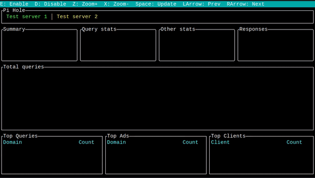

# Pimon
Pi-Hole TUI monitoring tool

## Example


## Usage
- Quit: `q`
- Force update: `<Space>`
- Tab navigation:
  - Previous server: `<left>`
  - Next server: `<right>`
- Graph navigation:
  - Zoom in: `z`
  - Zoom in: `x`

## CLI options
```
pimon

USAGE:
    pimon [OPTIONS]

FLAGS:
    -h, --help       Prints help information
    -V, --version    Prints version information

OPTIONS:
    -c, --config-file-path <config-file-path>    Path to configuration file [default: pimon.json]
```

## Configuration
```json
{
    "servers": [
        {
            "name": "Example 1",
            "host": "http://192.168.1.1",
            "api_key": "0123456789abcedf0123456789abcedf0123456789abcedf0123456789abcedf"
        },
        {
            "name": "Example 2",
            "host": "http://192.168.0.42"
        }
    ],
    "update_delay": 5000
}
```