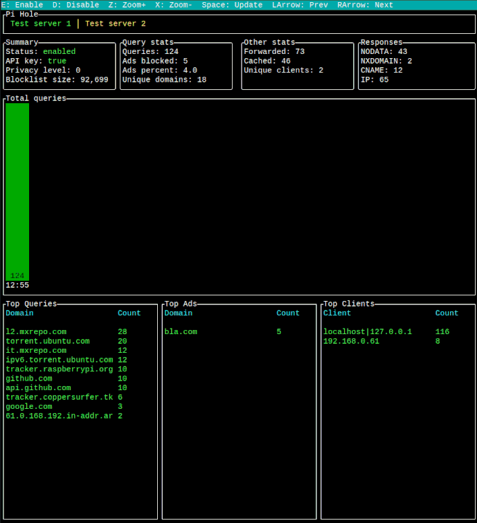

# Pimon
Pi-Hole terminal monitoring tool

## Example


# Features
- Support for multiple servers
- Optional API Keys
- Query graph with zoom
- Enable/Disable Pi-Hole

## Usage
For convenience you may want to alias `pimon` to point at a particular config e.g. `pimon -c $HOME/.config/pimon/pimon.json`.

### Keybindings:
- Quit: `q`
- Force update: `<Space>`
- Tab navigation:
  - Previous server: `<Left>`
  - Next server: `<Right>`
- Graph navigation:
  - Zoom in: `z`
  - Zoom in: `x`
- Enable current server: `e`
- Disable current server: `d`

## Installation

### Cargo
```
cargo install pimon
```

## CLI options
```
pimon

USAGE:
    pimon [OPTIONS]

FLAGS:
    -h, --help       Prints help information
    -V, --version    Prints version information

OPTIONS:
    -c, --config-file-path <config-file-path>    Path to configuration file [default: pimon.json]
```

## Example Configuration
Note: A prefix of `http://` or `https://` is required for the host attribute.
```json
{
    // List of servers. Length must be >= 1.
    "servers": [
        {
            // Name of server
            "name": "Example 1",
            // Host prefixed with protocol
            "host": "http://192.168.1.1",
            // Optional API Key (From Pi-Hole interface -> Settings -> API -> Show API Token)
            "api_key": "0123456789abcedf0123456789abcedf0123456789abcedf0123456789abcedf"
        },
        {
            "name": "Example 2",
            "host": "http://pihole.local"
        }
    ],
    // Delay between updates in milliseconds
    "update_delay": 5000
}
```